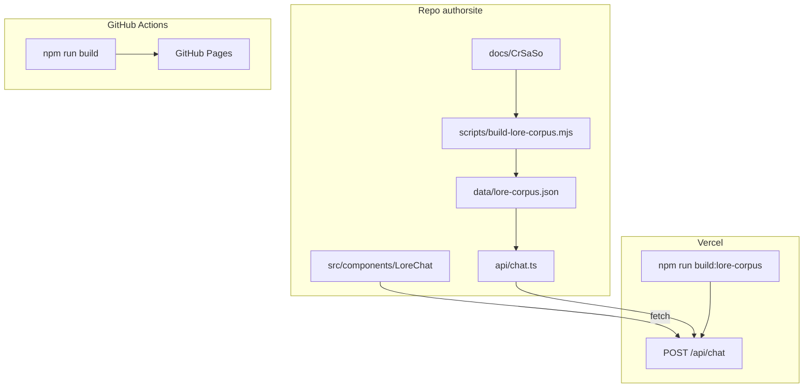

# Chat API — monorepo (GitHub Pages + Vercel)

El chat de lore vive en **este mismo repositorio** (`authorsite`):

| Parte | Ubicación | Hosting |
|-------|-----------|---------|
| UI del chat | `src/components/LoreChat/` | GitHub Pages |
| API del chat | `api/chat.ts` + `lib/chat/` | Vercel |
| Corpus de lore | `scripts/build-lore-corpus.mjs` → `data/lore-corpus.json` | Generado en build de Vercel |
| Contenido fuente | `docs/CrSaSo/` | — |

GitHub Actions sigue desplegando solo el sitio Docusaurus. Vercel despliega **únicamente** las serverless functions (no el sitio estático).

---

## Arquitectura



---

## Estructura de archivos

```
authorsite/
├── api/
│   └── chat.ts                 # Handler Vercel
├── lib/chat/
│   ├── corpus.ts               # Carga JSON + búsqueda por keywords
│   ├── gemini.ts               # Cliente Gemini
│   ├── cors.ts                 # Orígenes permitidos
│   └── types.ts
├── scripts/
│   └── build-lore-corpus.mjs   # Genera data/lore-corpus.json
├── data/
│   └── lore-corpus.json        # Generado (gitignore)
├── vercel.json
└── src/components/LoreChat/    # Frontend (landing page)
```

---

## Contrato del endpoint

### `POST /api/chat`

**Request:**

```json
{
  "message": "¿Quién es Anya Rudzki?",
  "history": [
    { "role": "user", "content": "Hola" },
    { "role": "assistant", "content": "Hola, ¿en qué puedo ayudarte?" }
  ]
}
```

**Response 200:**

```json
{
  "reply": "Anya Rudzki es...",
  "sources": [
    { "title": "Anya Rudzki", "permalink": "/CrSaSo/personajes/Anya%20Rudzki" }
  ]
}
```

**Error:**

```json
{ "error": "Descripción del error" }
```

Tipos en [`src/components/LoreChat/types.ts`](../../src/components/LoreChat/types.ts) (frontend) y [`lib/chat/types.ts`](../../lib/chat/types.ts) (API).

---

## Desarrollo local

Dos terminales (Docusaurus usa el puerto 3000):

| Terminal | Comando | URL |
|----------|---------|-----|
| 1 | `npm start` | http://localhost:3000/authorsite2/ |
| 2 | `npm run dev:chat-api` | http://localhost:3001/api/chat |

En `.env` (copiar desde `.env.example`):

```
CHAT_API_URL=http://localhost:3001/api/chat
```

Para la API local, crea `.env` con `GEMINI_API_KEY` (Vercel CLI la carga en `vercel dev`).

Regenerar corpus manualmente:

```bash
npm run build:lore-corpus
```

---

## Deploy en Vercel

1. Importar **este repo** en [vercel.com](https://vercel.com).
2. Framework preset: **Other** (o dejar que `vercel.json` aplique `"framework": null`).
3. Variables de entorno en Vercel:
   - `GEMINI_API_KEY` — [Google AI Studio](https://aistudio.google.com/apikey)
   - `GEMINI_MODEL` — opcional, default `gemini-2.0-flash`
4. Deploy. La URL será algo como `https://authorsite.vercel.app/api/chat`.

El build de Vercel ejecuta `npm run vercel-build` → solo genera el corpus (ver [`vercel.json`](../../vercel.json)). **No** ejecuta `docusaurus build`.

### Si el deploy falla o corre `docusaurus build`

Los **warnings** (`onBrokenMarkdownLinks`, `uuid`, Node) no suelen bloquear el deploy. Lo que falla es que Vercel intenta construir **todo el sitio** con `npm run build` (Docusaurus), que revienta por **enlaces rotos** en los MDX.

Causas habituales:

1. **`vercel.json` no está en la rama desplegada** — hay que hacer commit y push de `vercel.json`, `api/`, `lib/chat/`, etc.
2. **Preset incorrecto en el dashboard** — en Vercel → Project → Settings → General:
   - **Framework Preset:** Other
   - **Build Command:** `npm run vercel-build` (o dejar vacío si confías en `vercel.json`)
   - **Output Directory:** `public` (no `build`)
3. **Override en el dashboard** que fuerza `npm run build` — bórralo o cámbialo.

Tras un deploy correcto, en los logs deberías ver `npm run vercel-build` y `[build-lore-corpus]`, **no** `docusaurus build`.

---

## Producción (GitHub Pages)

1. En GitHub: **Settings → Secrets and variables → Actions → Variables**
2. Crear `CHAT_API_URL` = `https://<tu-proyecto>.vercel.app/api/chat`
3. El workflow [`.github/workflows/deploy.yml`](../../.github/workflows/deploy.yml) inyecta la variable en `npm run build`.

Docusaurus expone la URL vía `customFields.chatApiUrl` en [`docusaurus.config.js`](../../docusaurus.config.js).

---

## CORS

Orígenes permitidos (ver [`lib/chat/cors.ts`](../../lib/chat/cors.ts)):

- `https://TheAncientOne123.github.io` — producción
- `http://localhost:3000` — dev Docusaurus

---

## Corpus de lore

El script [`scripts/build-lore-corpus.mjs`](../../scripts/build-lore-corpus.mjs) lee:

- `docs/CrSaSo/personajes/`
- `docs/CrSaSo/lugares/`
- `docs/CrSaSo/eventos/`
- `docs/CrSaSo/familias/`
- `docs/CrSaSo/libros/`
- `docs/CrSaSo/objetos-conceptos/`

Por cada MDX: frontmatter + texto limpio (sin JSX). La API recupera entradas relevantes por **keywords** (sin RAG/embeddings en v1) y las pasa a Gemini.

---

## Probar el endpoint

```bash
curl -X POST https://<tu-proyecto>.vercel.app/api/chat \
  -H "Content-Type: application/json" \
  -H "Origin: https://TheAncientOne123.github.io" \
  -d "{\"message\":\"¿Quién es Anya Rudzki?\"}"
```

---

## Checklist

- [ ] `npm run build:lore-corpus` genera `data/lore-corpus.json`
- [ ] Proyecto Vercel vinculado a este repo
- [ ] `GEMINI_API_KEY` configurada en Vercel
- [ ] Variable `CHAT_API_URL` en GitHub Actions
- [ ] Chat funcional en landing (local y producción)

---

## Fuera de alcance (v1)

- RAG con embeddings
- Desplegar Docusaurus en Vercel (duplicaría GitHub Pages)
- `build:lore-corpus` en `prebuild` de Docusaurus (ralentizaría dev del sitio)
